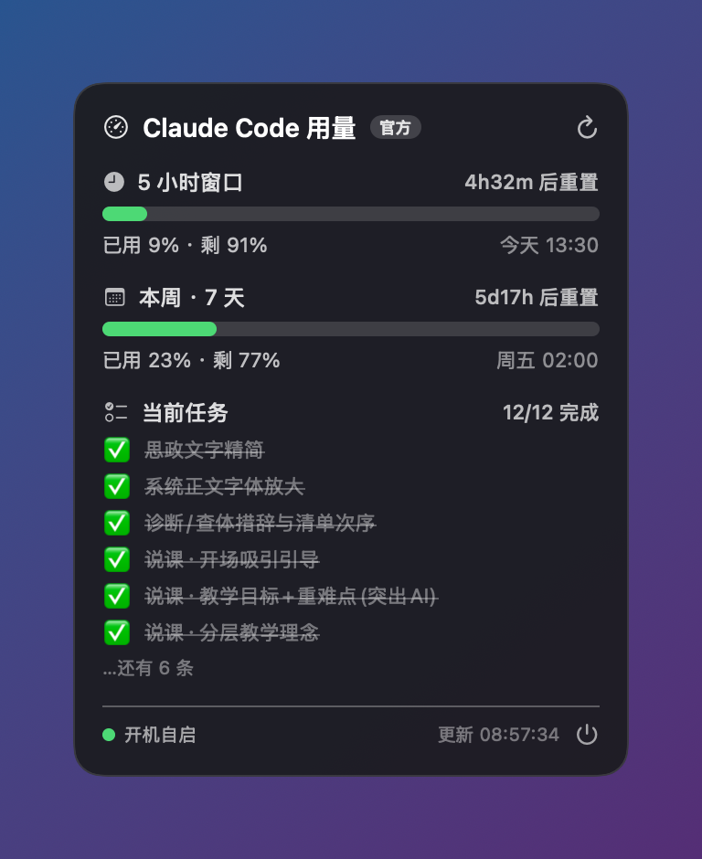

# ClaudeMeter

A tiny native macOS **menu-bar app** that shows your **official Claude Code usage** — the same 5-hour and weekly limit numbers you see in *Settings → Usage* — right in your menu bar, plus a draggable translucent floating panel.

No Electron, no background daemon, ~5 MB, written in a single Swift file.



> **Menu bar:** `🟢 5h 9%·4h32m · 周 23%·5d17h`
> **Panel (click it):** 5-hour window + weekly window, each with used % / remaining % / reset countdown / reset clock, plus your current Claude Code task list.

---

## ✨ Features

- **Official numbers, not estimates.** Reads Anthropic's `anthropic-ratelimit-unified-*` response headers — the exact source behind *Settings → Usage*. Cross-checks 1:1.
- **5-hour window + weekly window**, each with used %, remaining %, and a live reset countdown + absolute reset time.
- **Draggable, translucent floating panel** (native `NSPanel` + `NSVisualEffectView`), always-on-top, movable anywhere.
- **Current task list** — best-effort read of Claude Code's local TODO list (`~/.claude/tasks/`).
- **Color status dot** driven by Anthropic's `unified-status` (`allowed` / `warning` / `rejected`).
- **Tiny footprint.** Single Swift file, no runtime dependencies, ~5 MB RAM, no Dock icon (`LSUIElement`).
- **Launch at login** toggle built in.

## 📋 Requirements

- macOS **14 (Sonoma)** or newer.
- An active **Claude subscription** (Pro or Max) used with **Claude Code**.
- **Claude Code CLI** installed (`claude` on your `PATH`) — needed once, to mint a token.
- **Xcode Command Line Tools** to build from source: `xcode-select --install`.
- Apple Silicon by default. On Intel, change `-target arm64-apple-macos14.0` to `x86_64-apple-macos14.0` in `build.sh`.

## 🚀 Install

### Option A — build from source (recommended)

```bash
git clone https://github.com/quanqiutongshi01-svg/ClaudeMeter.git
cd ClaudeMeter
./build.sh
cp -R ClaudeMeter.app /Applications/
```

### Option B — prebuilt `.dmg`

Download `ClaudeMeter-x.y.z.dmg` from [Releases](https://github.com/quanqiutongshi01-svg/ClaudeMeter/releases), open it, drag **ClaudeMeter** to **Applications**.
Because the app is **ad-hoc signed (not notarized)**, the first launch needs:
**right-click the app → Open → Open**, or
`xattr -dr com.apple.quarantine /Applications/ClaudeMeter.app`.

## 🔑 Setup — give it a token (one time)

ClaudeMeter reads your usage by making one tiny authenticated request, so it needs a token. Generate a long-lived one with the official command (valid 1 year):

```bash
# 1) Mint a token (opens a browser to authorize; prints an sk-ant-oat01-… token)
claude setup-token

# 2) Save it where ClaudeMeter looks (replace the placeholder with your token)
mkdir -p ~/.claude/ccmenubar
printf '%s' 'PASTE_YOUR_TOKEN_HERE' > ~/.claude/ccmenubar/claude-token
chmod 600 ~/.claude/ccmenubar/claude-token
```

> The token **never leaves your machine** — it sits in a local file that only ClaudeMeter reads.
> Internal whitespace/newlines from a wrapped copy are stripped automatically.

Then launch it and click the menu-bar item:

```bash
open /Applications/ClaudeMeter.app
```

Open the panel and flip **“开机自启 / Launch at login”** on so it survives reboots.

## 🔍 Does it match *Settings → Usage*?

Yes — open *Settings → Usage* in the Claude desktop app and compare. If a number looks "off," it's almost always because a **5-hour window just reset** (usage drops back near 0% at the reset time shown). The weekly window resets weekly at the time ClaudeMeter shows.

## ⚙️ How it works (short version)

The obvious endpoint, `GET /api/oauth/usage`, requires the `user:profile` OAuth scope, which a `claude setup-token` token **doesn't** have (you'd get `403`). Instead, ClaudeMeter sends a **1-token `POST /v1/messages`** request and reads the rate-limit **response headers** Anthropic returns to subscription clients:

```
anthropic-ratelimit-unified-5h-utilization: 0.09     # 5h used fraction
anthropic-ratelimit-unified-5h-reset:       1781328600 # epoch seconds
anthropic-ratelimit-unified-7d-utilization: 0.23     # weekly used fraction
anthropic-ratelimit-unified-7d-reset:       1781805600
anthropic-ratelimit-unified-status:         allowed
```

Full details, including the exact request and why the system prompt must start with `You are Claude Code, …`, are in **[docs/TECHNICAL.md](docs/TECHNICAL.md)**.

**Cost & privacy:** ClaudeMeter polls every **120 s** with a ~22-token request (a 30 s timer refreshes only the countdown, no request). That's a negligible but non-zero amount of *your own* quota. It talks only to `api.anthropic.com`, with your token, read-only.

## 🛠 Troubleshooting

| Symptom | Fix |
|---|---|
| Menu bar shows `⚙︎ 待配置` | Token file missing/empty — redo the Setup step. |
| Panel shows `token 失效/无权限` | Token expired/revoked — rerun `claude setup-token` and overwrite the file. |
| Numbers differ from Settings→Usage | The 5h window reset; reopen Settings→Usage — it'll match. |
| Prebuilt app won't open | Gatekeeper — right-click → Open, or strip quarantine (see Install B). |

## 🚧 Limitations

- **Codex usage is not supported (yet).** The Codex desktop app doesn't persist its live rate-limit to a pollable place and exposes no REST usage endpoint, so a passive monitor can't read it. PRs welcome if that changes.
- Prebuilt binaries are **not notarized** (no paid Apple Developer account). Building from source avoids the Gatekeeper prompt.

## 🤝 Contributing

Issues and PRs welcome — extra windows/stats, an app icon, Intel builds, Codex support, etc.

## 📄 License

[MIT](LICENSE) © 2026 Leo

---
---

# ClaudeMeter（中文）

一个极小的原生 macOS **菜单栏 App**，把你的 **Claude Code 官方用量**——也就是 *Settings → Usage* 里那套 5 小时 / 每周限额——直接显示在菜单栏，并配一个可拖动的半透明浮窗。

非 Electron、无后台守护进程、约 5 MB，单个 Swift 文件实现。

> **菜单栏：** `🟢 5h 9%·4h32m · 周 23%·5d17h`
> **点击弹出浮窗：** 5 小时窗口 + 每周窗口，各显示 已用% / 剩余% / 重置倒计时 / 重置时刻，外加当前 Claude Code 任务列表。

## ✨ 特性

- **官方口径，不是估算。** 读取 Anthropic 的 `anthropic-ratelimit-unified-*` 响应头——正是 *Settings → Usage* 背后的同一数据源，可逐一对上。
- **5 小时窗口 + 每周窗口**，各含 已用%、剩余%、实时重置倒计时 + 绝对重置时刻。
- **可拖动的半透明浮窗**（原生 `NSPanel` + 毛玻璃），置顶、可任意拖动。
- **当前任务列表**——尽力读取 Claude Code 本地 TODO（`~/.claude/tasks/`）。
- **状态色点**由 Anthropic 的 `unified-status`（allowed / warning / rejected）驱动。
- **占用极小**，无 Dock 图标（`LSUIElement` 菜单栏代理）。
- 内置 **开机自启** 开关。

## 📋 环境要求

- macOS **14 (Sonoma)** 及以上。
- 有效的 **Claude 订阅**（Pro 或 Max），且在用 **Claude Code**。
- 已安装 **Claude Code CLI**（`claude` 在 `PATH` 上）——仅生成 token 用一次。
- 从源码构建需 **Xcode 命令行工具**：`xcode-select --install`。
- 默认 Apple Silicon；Intel 机器把 `build.sh` 里的 `-target arm64-apple-macos14.0` 改成 `x86_64-apple-macos14.0`。

## 🚀 安装

**方式 A — 从源码构建（推荐）**

```bash
git clone https://github.com/quanqiutongshi01-svg/ClaudeMeter.git
cd ClaudeMeter
./build.sh
cp -R ClaudeMeter.app /Applications/
```

**方式 B — 预编译 `.dmg`**：从 Releases 下载，拖进「应用程序」。因为是**临时签名（未公证）**，首次打开需 **右键 → 打开 → 打开**，或 `xattr -dr com.apple.quarantine /Applications/ClaudeMeter.app`。

## 🔑 配置 token（一次性）

ClaudeMeter 靠发一个极小的已认证请求来读用量，所以需要一个 token。用官方命令生成一个长期 token（有效 1 年）：

```bash
# 1) 生成 token（会开浏览器授权，然后打印一个 sk-ant-oat01-… 的 token）
claude setup-token

# 2) 存到 ClaudeMeter 读取的位置（把占位符换成你的 token）
mkdir -p ~/.claude/ccmenubar
printf '%s' '粘贴你的token' > ~/.claude/ccmenubar/claude-token
chmod 600 ~/.claude/ccmenubar/claude-token
```

> token **不会离开你的电脑**——只存在一个本地文件里、只有 ClaudeMeter 读它。换行/空白会被自动剥除。

然后启动、点菜单栏图标、在浮窗里把 **开机自启** 打开即可。

## 🔍 和官方对得上吗？

对得上。打开 Claude 桌面版 *Settings → Usage* 对照即可。若某个数字"看着不对"，多半是**那个 5 小时窗口刚重置**（到重置时刻用量会掉回接近 0%）。

## ⚙️ 工作原理（简版）

直觉上的接口 `GET /api/oauth/usage` 需要 `user:profile` 这个 OAuth scope，而 `claude setup-token` 生成的 token **没有**（会 `403`）。所以 ClaudeMeter 改为发一个 **1 token 的 `POST /v1/messages`** 请求，读取 Anthropic 给订阅客户端返回的限额**响应头**（`anthropic-ratelimit-unified-5h-utilization / -7d-utilization / -reset / -status`）。完整细节（含为何 system 提示词必须以 `You are Claude Code, …` 开头）见 **[docs/TECHNICAL.md](docs/TECHNICAL.md)**。

**代价与隐私：** 每 **120 秒**发一个约 22 token 的请求（另有 30 秒定时器只刷新倒计时、不发请求）。这会消耗你**自己**额度的极小一部分。只与 `api.anthropic.com` 通信、用你的 token、只读。

## 🚧 限制

- **暂不支持 Codex 用量**：Codex 桌面版当前不把实时限额落盘到可轮询的位置、也无 REST 用量端点，被动监视器取不到。若日后改变，欢迎 PR。
- 预编译产物**未公证**；从源码构建可避开 Gatekeeper 提示。

## 📄 许可证

[MIT](LICENSE) © 2026 Leo
