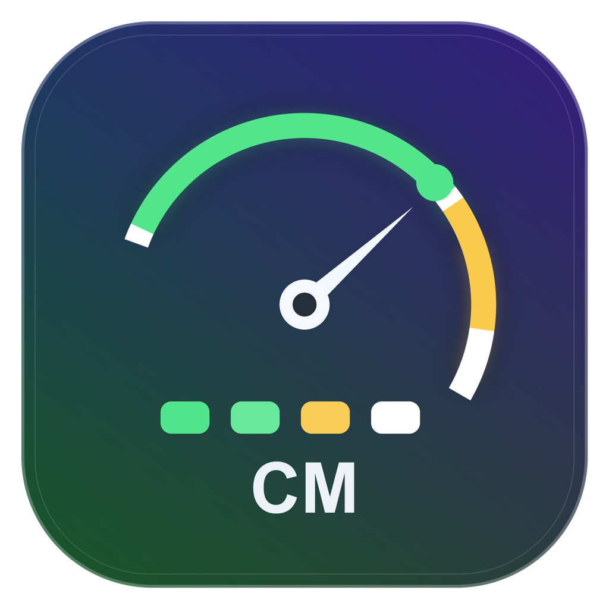

# TokenMeter

<p align="center">
  
</p>

[](https://github.com/quanqiutongshi01-svg/ClaudeMeter/releases)
[](LICENSE)
[](README.md#requirements)
[](main.swift)
[](docs/TECHNICAL.md)

TokenMeter is a tiny native macOS **menu-bar app** for watching AI coding quota in one place:

- **Claude Code**: official 5-hour and weekly usage from Anthropic response headers.
- **Codex**: best-effort 5-hour and weekly usage from local `codex.rate_limits` websocket logs.

No Electron, no daemon, no hidden Codex request. The menu bar stays compact and configurable, and the floating panel shows the full Claude/Codex breakdown.


> Menu bar examples: `Cl 94% · Cx 92%` or `Cl 94%/85% · Cx 92%/96%`
> Values in the menu bar are remaining quota. Orange means any displayed window is at or below 20% left; red means 10% or less. `~Cx` means the latest Codex snapshot may be stale; it does not change the menu-bar color by itself.

---

## Features

- **Unified monitor.** Claude Code and Codex appear in the same menu-bar item and floating panel.
- **Configurable menu bar.** Choose 5-hour-only mode or 5-hour + weekly mode from the floating panel.
- **Claude official numbers.** Reads `anthropic-ratelimit-unified-*` headers, the same source behind Claude Code's usage window.
- **Codex best-effort numbers.** Reads the latest local `codex.rate_limits` event from `~/.codex/logs_2.sqlite` or `~/.codex/sqlite/logs_2.sqlite`.
- **Multi-log Codex scan.** TokenMeter scans both known Codex SQLite locations and picks the freshest parseable snapshot, so an older legacy log will not mask a newer active log.
- **Effective Codex limits.** If Codex logs model-specific `additional_rate_limits`, TokenMeter uses the tightest 5-hour/weekly bucket so the menu bar reflects the quota most likely to block usage.
- **No hidden Codex spend.** TokenMeter never starts a Codex model turn just to refresh quota.
- **Freshness-aware UI.** Codex data is marked fresh, stale, or unavailable depending on the latest local snapshot.
- **Native macOS HUD.** Draggable translucent floating panel, menu-bar only, no Dock icon.
- **Launch at login** toggle built in.

## Requirements

- macOS **14 (Sonoma)** or newer.
- For Claude Code: active Claude subscription, Claude Code CLI installed, and a `claude setup-token` token.
- For Codex: Codex desktop/CLI must have produced at least one local `codex.rate_limits` log event.
- Xcode Command Line Tools to build from source: `xcode-select --install`.
- Apple Silicon by default. On Intel, change `-target arm64-apple-macos14.0` to `x86_64-apple-macos14.0` in `build.sh`.

## Install

### Option A - build from source

```bash
git clone https://github.com/quanqiutongshi01-svg/ClaudeMeter.git
cd ClaudeMeter
./build.sh
cp -R TokenMeter.app /Applications/
open /Applications/TokenMeter.app
```

### Option B - prebuilt DMG

Download `TokenMeter-x.y.z.dmg` from [Releases](https://github.com/quanqiutongshi01-svg/ClaudeMeter/releases), open it, and drag **TokenMeter** to **Applications**.

The app is ad-hoc signed, not notarized. On first launch, use **right-click -> Open -> Open**, or:

```bash
xattr -dr com.apple.quarantine /Applications/TokenMeter.app
```

## Claude Setup

Claude usage needs a local OAuth token minted by the official Claude Code CLI:

```bash
# 1) Mint a token. This opens a browser and prints an sk-ant-oat01-... token.
claude setup-token

# 2) Save it where TokenMeter reads it.
mkdir -p ~/.claude/ccmenubar
printf '%s' 'PASTE_YOUR_TOKEN_HERE' > ~/.claude/ccmenubar/claude-token
chmod 600 ~/.claude/ccmenubar/claude-token
```

The token stays on your machine and is only sent to `api.anthropic.com` for the tiny Claude usage-header request.

## Codex Setup

There is no Codex token setup in TokenMeter.

TokenMeter reads the latest local Codex rate-limit snapshot if Codex has logged one. If the Codex card says stale or unavailable:

1. Click **Open** or open Codex yourself.
2. Complete one normal Codex request.
3. Press refresh in TokenMeter.

This is intentional: TokenMeter does **not** make a hidden Codex request, because that would consume your Codex allowance.

The **Open** button only brings Codex to the front. It cannot force Codex to publish a new quota snapshot by itself; Codex usually writes the fresh `codex.rate_limits` event after a normal model response.

## Limitations

- Claude support is official-header based and should match Claude Code usage to the percent.
- Codex support is **best effort** and log-based. It depends on local Codex builds continuing to log `codex.rate_limits` websocket events.
- Codex numbers refresh only after Codex itself receives a new rate-limit event.
- Prebuilt binaries are not notarized.

## Build And Debug

```bash
./build.sh
TOKENMETER_SHOW=1 open TokenMeter.app
./TokenMeter.app/Contents/MacOS/TokenMeter --render assets/screenshot.png
```

## Contributing

Issues and PRs are welcome: Intel builds, more providers, a settings screen, better packaging, or a future official Codex usage endpoint.

## License

[MIT](LICENSE) © 2026 Leo

---

# TokenMeter（中文）

TokenMeter 是一个极小的原生 macOS **菜单栏 App**，用于把 AI 编程工具的额度放在一个地方看：

- **Claude Code**：通过 Anthropic 响应头读取官方 5 小时窗口和每周窗口。
- **Codex**：从本机 `codex.rate_limits` websocket 日志读取 5 小时窗口和每周窗口，属于最佳努力模式。

非 Electron、无后台守护进程、不会偷偷发 Codex 请求。菜单栏保持紧凑且可配置，浮窗里展示 Claude/Codex 的完整拆分。

> 菜单栏示例：`Cl 94% · Cx 92%` 或 `Cl 94%/85% · Cx 92%/96%`
> 菜单栏显示的是剩余额度。任一显示窗口剩余 ≤20% 时变橙，≤10% 时变红。`~Cx` 表示最新 Codex 快照可能已经过期；它本身不会让菜单栏变色。

## 特性

- **统一监控。** Claude Code 和 Codex 同时出现在菜单栏和浮窗中。
- **菜单栏可配置。** 可在浮窗中选择只显示 5 小时窗口，或同时显示 5 小时 + 周窗口。
- **Claude 官方口径。** 读取 `anthropic-ratelimit-unified-*` 响应头，和 Claude Code 用量窗口同源。
- **Codex 最佳努力口径。** 读取 `~/.codex/logs_2.sqlite` 或 `~/.codex/sqlite/logs_2.sqlite` 中最新的 `codex.rate_limits` 事件。
- **Codex 多日志扫描。** TokenMeter 会同时扫描两个已知 Codex SQLite 位置，并选择最新、可解析的快照，避免旧日志遮住新日志。
- **Codex 有效限制。** 如果 Codex 日志里出现模型级 `additional_rate_limits`，TokenMeter 会选择 5 小时/周窗口里更紧的那个额度，避免菜单栏低估真正会卡住使用的限制。
- **不隐藏消耗 Codex。** TokenMeter 不会为了刷新额度而主动触发 Codex 模型请求。
- **显示数据新鲜度。** Codex 数据会标记为新鲜、可能过期或不可用。
- **原生 macOS 浮窗。** 半透明可拖动 HUD，只在菜单栏显示，无 Dock 图标。
- 内置 **开机自启** 开关。

## 环境要求

- macOS **14 (Sonoma)** 及以上。
- Claude Code：需要有效 Claude 订阅、Claude Code CLI，以及 `claude setup-token` 生成的 token。
- Codex：需要 Codex 桌面版或 CLI 曾经在本机写入过 `codex.rate_limits` 日志。
- 从源码构建需 Xcode 命令行工具：`xcode-select --install`。
- 默认 Apple Silicon；Intel 机器把 `build.sh` 里的 `-target arm64-apple-macos14.0` 改成 `x86_64-apple-macos14.0`。

## 安装

### 方式 A - 从源码构建

```bash
git clone https://github.com/quanqiutongshi01-svg/ClaudeMeter.git
cd ClaudeMeter
./build.sh
cp -R TokenMeter.app /Applications/
open /Applications/TokenMeter.app
```

### 方式 B - 预编译 DMG

从 [Releases](https://github.com/quanqiutongshi01-svg/ClaudeMeter/releases) 下载 `TokenMeter-x.y.z.dmg`，打开后把 **TokenMeter** 拖到「应用程序」。

预编译 App 是临时签名，未公证。首次打开请 **右键 -> 打开 -> 打开**，或运行：

```bash
xattr -dr com.apple.quarantine /Applications/TokenMeter.app
```

## Claude 配置

Claude 用量需要用官方 Claude Code CLI 生成一个本地 OAuth token：

```bash
# 1) 生成 token。会打开浏览器授权，然后打印一个 sk-ant-oat01-... token。
claude setup-token

# 2) 保存到 TokenMeter 读取的位置。
mkdir -p ~/.claude/ccmenubar
printf '%s' '粘贴你的token' > ~/.claude/ccmenubar/claude-token
chmod 600 ~/.claude/ccmenubar/claude-token
```

这个 token 只保存在你的电脑上，只会被用于向 `api.anthropic.com` 发一个极小的 Claude 用量响应头请求。

## Codex 配置

Codex 不需要在 TokenMeter 里额外配置 token。

TokenMeter 会读取 Codex 本机日志里的最新限额快照。如果 Codex 卡片显示“可能过期”或“不可用”：

1. 点击 **Open**，或你自己打开 Codex。
2. 正常完成一次 Codex 请求。
3. 回到 TokenMeter 点击刷新。

这是有意设计：TokenMeter 不会偷偷发 Codex 请求，因为那会消耗你的 Codex 额度。

**Open** 按钮只负责把 Codex 唤到前台；它本身不能强制 Codex 写入新的额度快照。通常要等一次正常模型回复完成后，Codex 才会写入新的 `codex.rate_limits` 事件。

## 限制

- Claude 支持来自官方响应头，通常应与 Claude Code 用量窗口逐百分比对上。
- Codex 支持是**本地日志读取，最佳努力**，依赖当前 Codex 版本继续记录 `codex.rate_limits` websocket 事件。
- Codex 数字只有在 Codex 自己收到新的 rate-limit 事件后才会刷新。
- 预编译二进制未公证。

## 构建和调试

```bash
./build.sh
TOKENMETER_SHOW=1 open TokenMeter.app
./TokenMeter.app/Contents/MacOS/TokenMeter --render assets/screenshot.png
```

## 贡献

欢迎 issue 和 PR：Intel 构建、更多 provider、设置界面、更好的打包方式，或者未来的 Codex 官方用量接口支持。

## 许可证

[MIT](LICENSE) © 2026 Leo
